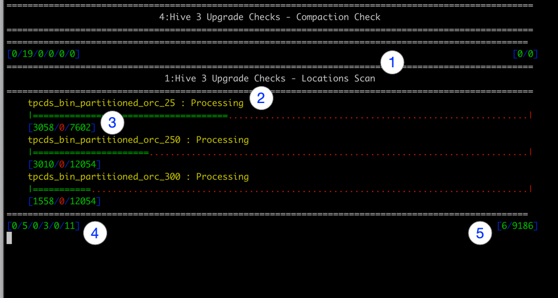

# Hive SRE Tooling

This application has 3 sub-programs:

- [`perf`](#hive-jdbc-performance-testing-tool-perf) is used to check the throughput of a JDBC connection.
- [`sre`](#sre-application-sre) is used to find potential 'Hive' performance issues caused by small files and excessive partitions.
- [`u3`](#hive-upgrade-check-u3) is used to review 'Hive 1/2' environments for Hive3 upgrade planning.
- [`cli`-external reference](https://github.com/dstreev/hadoop-cli/blob/master/README.md) is an hdfs interactive client.  It is a core part of the `hive-sre` application, so we've exposed the shell here via the `hive-sre-cli` executable.

## Supported Metastore DB's

| Sub-Program | Database | Version | Tested | Notes |
|:---|:---|:---|:---|:---|
| `u3` | MySql | 5.6 | Limited | Recommend upgrading 5.7.  This is the lower MySql supported env for HDP |
|  |  | 5.7 | Yes |  |
|  |  | 5.7 | Yes |  |
|  |  | 8.0 | No | Not supported by HDP |
|  | MariaDb | 10.1 | No, but should work as 10.2 does |   |
|  |  | 10.2 | Yes |  |
|  | Postgresql | 9.6 | No, but should work |  |
|  |  | 10 | Yes | Field Tested, May still be a few rough edges |
|  |  | 11 | No, but should work at 10 does |  |
|  | Oracle | 12 | Yes | Field Tested, May still be a few rough edges |
| `sre` | MySql | 5.6 | Limited | Recommend upgrading 5.7.  This is the lower MySql supported env for HDP |
|  |  | 5.7 | Yes |  |
|  |  | 5.7 | Yes |  |
|  |  | 8.0 | No | Not supported by HDP |
|  | MariaDb | 10.1 | No, but should work as 10.2 does |   |
|  |  | 10.2 | Yes |  |
|  | Postgresql | 9.6 | No, but should work |  |
|  |  | 10 | Yes | Field Tested, May still be a few rough edges |
|  |  | 11 | No, but should work at 10 does |  |
|  | Oracle | 12 | Yes | Field Tested, May still be a few rough edges |

Ensure you have the database appropriate driver in the `${HOME}/.hive-sre/aux_lib` directory.

I've tried to match supported DB's for HDP 2.6.5 and 3.1.x as much as I could.

### Binary

USE THE PRE-BUILT BINARY!!!  You won't have the necessary dependencies to build this from scratch without downloading and building the 'Hadoop Cli'.

_**Don't Build, Download the LATEST binary here!!!**_ 

[](https://github.com/dstreev/cloudera_upgrade_utils/releases)

* Download the release 'tar.gz' file to a temp location.
* Untar the file (tar.gz).
```
tar xzvf <release>.tar.gz
cd hive-sre
```  
* As a root user, chmod +x the 3 shell script files.
* Run the 'setup.sh'.
```
./setup
```  

This will create and install the `hive-sre` and `hive-sre-cli` applications to your path.

Try it out on a host with default configs (if kerberized, get a ticket first):

    hive-sre-cli
OR
    
    hive-sre

### Default or Alt JDK Usage

The startup script `hive-sre|hive-sre-cli` will use `$JAVA_HOME` if defined.  When it is not available, the default `java` implementation will be used.

JDK's below 1.8.0_100 are not recommended for Kerberos environments and may have issues connecting to secure clusters.  Those JDK's require additional `unlimited jce` configurations.

If kerberos connections aren't working, use a more recent JDK by setting the `$JAVA_HOME` variable.
    

### AUX_LIBS - CLASSPATH Additions

The directory `$HOME/.hive-sre/aux_libs` will be scanned for 'jar' files. Each 'jar' will be added the java classpath of the application.  Add any required libaries here.

The application contains all the necesasry `hdfs` classes already.  You will need to add to the `aux_libs` directory the following:
- JDBC drivers for Metastore Connectivity
- JDBC drivers for Hive (Can be the Standalone driver from the cluster or other Hive Driver)
- AWS S3 Drivers (appropriate versions)
    - `hadoop-aws.jar`
    - `aws-java-sdk-bundle.jar`
    
## Hive JDBC Performance Testing Tool (perf)

JDBC Performance Testing tool.  Will provide connection timing details and rolling windows of performance for long running queries.  Details in the windows will show not only records but also an estimate of the data volume.

*Example Output*
```
========== v.2.0.1-SNAPSHOT ===========
URL        : jdbc:hive2://os04.streever.local:2181,os05.streever.local:2181,os10.streever.local:2181/;serviceDiscoveryMode=zooKeeper;zooKeeperNamespace=hiveserver2;principal=hive/_HOST@STREEVER.LOCAL
Batch Size : 10000
SQL        : SELECT field1_1,field1_2,field1_3,field1_4 FROM perf_test.wide_table
Lite       : false
----------------------------
Connect Attempt  : 0ms
Connected        : 2201ms
Create Statement : 2205ms
Before Query     : 2205ms
Query Return     : 2697ms
Start Iterating Results   : 2698ms
Completed Iterating Results: 79408ms
Statement Closed           : 79452ms
Resultset Closed           : 79452ms
Process Completed          : 79471ms

----------------------------
Window Length(ms) | Record Average | Records per/sec | Data Size per/sec
60000		7710000		128500		14970260
180000		10020000		125250		14642405
300000		10020000		125250		14642405
600000		10020000		125250		14642405

===========================
Running for: 80966ms		Started: 2020-03-06 13:57:40.492		Record Count: 10020000		Data Size: 1171392406
```

**Environment and Connection via Knox**

*Example*  Note: The additional `cp` setting with `hadoop classpath` is required when connecting to a Kerberized endpoint.
```
URL="jdbc:hive2://os06.streever.local:8443/;ssl=true;sslTrustStore=/home/dstreev/certs/bm90-gateway.jks;trustStorePassword=hortonworks;transportMode=http;httpPath=gateway/default/hive"
QUERY="SELECT field1_1,field1_2,field1_3,field1_4 FROM perf_test.wide_table"
BATCH_SIZE=10000
PW=<set_me>

hive-sre perf -u "${URL}" -e "${QUERY}" -b $BATCH_SIZE -n ${USER} -p <password> 
```

**Environment and Connection via Kerberos from Edge**

*Example* Note: Additional hadoop libraries are required for a kerberized connection.  Use `--hadoop-classpath` in the commandline to call the environments hadoop classpath and add it to the `cp` of the application.
```
URL="jdbc:hive2://os05.streever.local:10601/default;httpPath=cliservice;principal=hive/_HOST@STREEVER.LOCAL;transportMode=http"
QUERY="SELECT field1_1,field1_2,field1_3,field1_4 FROM perf_test.wide_table"
# Note that `hadoop classpath` statement to bring in all necessary libs.
BATCH_SIZE=10000

hive-sre --hadoop-classpath perf -u "${URL}" -e "${QUERY}" -b $BATCH_SIZE 
```

**Environment and Connection via Kerberos from a Client Host (Non-Edge)**

Even with a valid Kerberos ticket, this type of host will not have all the `hadoop` libs we get from `hadoop classpath` to work.  I have not yet been able to find the right mix of classes to add to the 'uber' jar to get this working.

## SRE Application (sre)

The Sre Tool brings together information from the HMS RDBMS and HDFS to provide reports and potential actions to address areas of concern.  This process is a READ-ONLY process and does not perform any actions automatically.

Action commands for identified scenarios are written out to file(s), which can be reviewed / edited and run through either "beeline" for "hive" actions or in [Hadoop-CLI](https://github.com/dstreev/hadoop-cli) for hdfs commands.

This process is driven by a control file.  A template is [here](configs/default.yaml.template).  Make a copy, edit the needed parameters and reference it with the '-cfg' parameter when running the process.

### Known Issues

For a while during the evolution of Hive 3, there was a separate 'catalog' for Spark.  The queries in this process do NOT consider this alternate catalog and may yield cross products in some areas if the 'spark' catalog was used at any point.  Do to the nature of this tool and an attempt to use it across multiple versions of Hive, we do NOT include criteria regarding the 'catalog'.

### Assumptions

- Ran from a node on the cluster
    - That includes clients and configuration files for HDFS
- Ran by a user that has READ privileges to all HDFS directories.
- If cluster is 'kerberized', the user has a valid Kerberos Ticket 'before' starting the application.
- Drivers for the HMS database are available.
- The configuration file has been defined
- The HMS Metastore DB is on a supported RDBMS for the platform (version matters!)

### Application Help

```
Launching: sre
usage: Sre
 -cfg,--config <arg>     Config with details for the Sre Job.  Must match
                         the either sre or u3 selection.
 -db,--database <arg>    Comma separated list of Databases.  Will override
                         config. (upto 100)
 -i,--include <arg>      Comma separated list of process id's to run.
                         When not specified, ALL processes are run.
 -o,--output-dir <arg>   Output Directory to save results from Sre.
```

The `-db` parameter is optional.  When specified, it will limit the search to the databases listed as a parameter.  IE: `-db my_db,test_db`

The `-o` parameter is *required*.

To limit which process runs, use the `-i` (include) option at the command line with a comma separated list of ids (below) of desired processes.

| id (link to sample report) | process |
|:---|:---|
| [1](./sample_reports/sre/hms_report_summary.md) | Hive Metastore Summary<br/> - Numerous HMS reports outlining summary information about databases and tables |
| [2](./sample_reports/sre/hms_report_detail.md) | Hive Metastore Details<br/> - Numerous HMS reports outlining detailed information about databases and tables |
| [3](./sample_reports/sre/small_files.md) | Table and Partition Scan - Small Files |
| [4](./sample_reports/sre/table_volume.md) | Table and Partition Scan - Volume Report |
| [5](./sample_reports/sre/empty_datasets.md) | Table and Partition Scan - Empty Datasets |
| [6](./sample_reports/u3/managed_compactions.sql) | Table and Partition Compactions |

Sre needs to be run by a user with READ access to all the potential HDFS locations presented by the database/table/partition defined locations.
 
### The Configuration File

```
# Required to connect to Metastore RDBMS.  RDBMS driver needs to be included in the classpath
metastore_direct:
  uri: "FULL_RDMBS_URL_FOR_METASTORE_INCLUDING_THE_DB_NAME"
  type: MYSQL | POSTRGES | ORACLE
  # Needed for Oracle Connections to pick the right schema for hive.
  # initSql: "ALTER SESSION SET CURRENT_SCHEMA=<hive_schema>"
  connectionProperties:
    user: "DB_USER"
    password: "DB_PASSWORD"
  connectionPool:
    min: 3
    max: 5
# Control the number of threads to run scans with.  Should not exceed host core count.
# Increase parallelism will increase HDFS namenode pressure.  Advise monitoring namenode
# RPC latency while running this process.
parallelism: 4
queries:
  db_tbl_count:
    parameters:
      dbs:
        override: "%"
```

### Running

To ease the launch of the application below, configure these core environment variables.

```
hive-sre sre -db priv_dstreev -cfg /tmp/test.yaml -o ./sre-out` 
```

### Output

The output is a set of files with actions and error (when encountered).  The files maybe `txt` files or `markdown`.  You may want to use a `markdown` viewer for easier viewing of those reports.  The markdown viewer needs to support [github markdown tables](https://github.com/adam-p/markdown-here/wiki/Markdown-Cheatsheet#tables) .

## Hive Upgrade Check (u3)

Review Hive Metastore Databases and Tables for upgrade or simply to evaluate potential issues.  Using [HDP Upgrade Utils](https://github.com/dstreev/hdp3_upgrade_utils) as the baseline for this effort.  The intent is to make that process much more prescriptive and consumable by Cloudera customers.  The application is 'Hive' based, so it should work against both 'HDP', 'CDH', and 'CDP' clusters.

### Testing

I have tested this against MariaDB 10.2, Postgres, and Oracle.  I have seen reports of SQL issues against MySql 5.6, so this process will certainly have issues there.  If you run this in other DB configs, I would like to hear from you about it.

### Known Issues

For a while during the evolution of Hive 3, there was a separate 'catalog' for Spark.  The queries in this process do NOT consider this alternate catalog and may yield cross products in some areas if the 'spark' catalog was used at any point.  Even though this tool was designed for Hive 1 and 2 in mind, it can be run against Hive 3.  We do NOT include criteria regarding the 'catalog'.

### Assumptions

- Ran from a node on the cluster
    - That includes clients and configuration files for HDFS
- Ran by a user that has READ privileges to all HDFS directories.
- If cluster is 'kerberized', the user has a valid Kerberos Ticket 'before' starting the application.
- Drivers for the HMS database are available.
- The configuration file has been defined
- The HMS Metastore DB is on a supported RDBMS for the platform (version matters!)

### Application Help

```
Launching: u3
usage: Sre
 -cfg,--config <arg>     Config with details for the Sre Job.  Must match
                         the either sre or u3 selection.
 -db,--database <arg>    Comma separated list of 'Hive' Databases.  Will
                         override config. (upto 100)
 -i,--include <arg>      Comma separated list of process id's to run.
                         When not specified, ALL processes are run.
 -o,--output-dir <arg>   Output Directory to save results from Sre.

 ```

To limit which process runs, use the `-i` (include) option at the command line with a comma separated list of ids (below) of desired processes.

| id (link to sample report) | process |
|:---|:---|
| [1](./sample_reports/u3/loc_scan_missing_dirs.md) | Table / Partition Location Scan - Missing Directories |
| [2](./sample_reports/u3/bad_filenames_for_orc_conversion.md) | Table / Partition Location Scan - Bad ACID ORC Filenames |
| [3](./sample_reports/u3/managed_upgrade_2_acid.sql) | Hive 3 Upgrade Checks - Managed Non-ACID to ACID Table Migrations |
| [4](./sample_reports/u3/managed_compactions.sql) | Hive 3 Upgrade Checks - Compaction Check |
| [5](./sample_reports/u3/hms_checks.md) | Hive Metastore Check <br/> - Questionable Serde's Check<br/> - Managed Table Shadows<br/> - List Databases with Table/Partition Counts |


### The Configuration File

Same as above, defined in the ['sre'](#the-configuration-file) sub program.

### Running

Run the process first with the `-i 7` option to get a list of databases with table and partition counts.  With this information, you can develop a strategy to run the tool in parts using the `-db` option.  Multi-tasking can be controlled in the configuration files `parallelism` setting.

To ease the launch of the application below, configure these core environment variables.

### Output

The output is a set of files with actions and error (when encountered).  The files maybe `txt` files or `markdown`.  You may want to use a `markdown` viewer for easier viewing of those reports.  The markdown viewer needs to support [github markdown tables](https://github.com/adam-p/markdown-here/wiki/Markdown-Cheatsheet#tables) .

#### Examples
*All Hive Databases* - Will run ALL processes.
```
hive-sre u3 -cfg /tmp/test.yaml -o ./sre-out
```

*Targeted Hive Database* - Will run ALL processes on the 'priv_dstreev' hive database.
```
hive-sre u3 -db priv_dstreev -cfg /tmp/test.yaml -o ./sre-out
```

*Run ONLY compaction check on All Hive Database* - Using the `-i` option to run only the 'compaction check' sub routine.
```
hive-sre u3 -cfg /tmp/test.yaml -o ./sre-out -i 4
```

### Check and Validations Performed

NO action is taken by this process.  The output of each section will contain 'actions' for you to take when a scenario materializes.  It is up to you to carry out those actions after reviewing them.

1. Hive 3 Upgrade Checks - Locations Scan
    - Missing Directories
    > Missing Directories cause the upgrade conversion process to fail.  To prevent that failure, there are two choices for a 'missing directory'.  Either create it of drop the table/partition.

    - You have two choices based on the output of this process.                        
        - RECOMMENDED: Drop the table/partition OR
        - Create the missing directory referenced by the table/partition (empty directories have been known to cause hive table CBO issues, leading to performance slowdowns).
    - The output file from this process will provide commands to accomplish which ever direction you choose. Use 'hive' to run the sql statements.  Use [hadoopcli](https://github.com/dstreev/hadoop-cli) to run the 'hdfs' commands in bulk.
2. Hive 3 Upgrade Checks - Bad ORC Filenames
    - Bad Filename Format
    > Tables that would be convert from a Managed Non-Acid table to an ACID transactional table require the files to match a certain pattern. This process will scan the potential directories of these tables for bad filename patterns.  When located, it will indicate which tables/partitions have been file naming conventions that would prevent a successful conversion to ACID.  The best and easiest way to correct these files names is to use HiveSQL to rewrite the contents of the table/partition with a simple 'INSERT OVERWRITE TABLE xxx SELECT * FROM xxx'.  This type of statement will replace the current bad filenames with valid file names by rewriting the contents in HiveSQL.
3. Hive 3 Upgrade Checks - Managed Table Migrations
    - Ownership Check
    - Conversion to ACID tables
    > This process will list tables that will and 'could' be migrated to "Managed ACID" tables during the upgrade process.  If these tables are used by Spark OR data is managed by a separate process that interacts with the FileSystem, DO NOT LET THESE conversion happen.  The output of this process will supply Hive DDL commands to convert these tables to "EXTERNAL / PURGE" tables in Hive 3, which is the same as the 'classic' Hive 1/2 Managed Non-Acid table.                                                                      
4. Hive 3 Upgrade Checks - Compaction Check
    - Compaction Check
    > Review ACID tables for 'delta' directories.  Where 'delta' directories are found, we'll 
5. Questionable Serde's Check
    > Will list tables using SERDE's that are not standard to the platform.
    
    - Action here either:
        - Remove the table using the SERDE, if the SERDE isn't available
        - Ensure the SERDE is available during the upgrade so table can be evaluated.
6. Managed Table Shadows
    > In Hive 3, Managed tables are 'ACID' tables.  Sharing a location between two 'ACID' tables will cause compaction issues and data issues.  These need to be resolved before the upgrade.
7. Database / Table and Partition Counts
    > Use this to understand the scope of what is in the metastore.
                                            
### UI Details for `sre` and `u3`

Only active processes will show up in the UI.  The UI will refresh every second and display the current details below.

There are several 'processes' that are defined in `u3`.  Each process will run 1 or more 'sub-processes'.  The counters lists in the UI are specific to the 'process' and 'sub-processes' in that section.

The number of concurrent processes is controlled by the `parallelism` variable in the configuration yaml defined above.

1. Process Header - [process id: process name]
2. Sub Process - [table name: process state]
3. Sub Process Progress - [processed count / issues count / total in process count]
4. Process Footer Details.  Count of sub processes in various states. [Constructed:Waiting:Started:Processing:Error:Complete].  In the example below there are 5 sub-processes waiting for a slot to run, 3 sub-processes running, and 11 sub-processes that have completed.
5. Process Counts - [issues: processed so far]. The example below shows 6 issues in the 'Location Scan' and 9186 'completed checks' thus far.


                         
### Tips

- Sorting results for loc_scan..

```
sort -k 1 --field-separator="|" loc_scan_missing_dirs.md > loc_scan_missing_dirs_sorted.txt
```

## Troubleshooting

### Kerberos Connectivity Issues

Add Kerberos Java debugging parameters to the commandline.

```
hive-sre -Dsun.security.krb5.debug=true u3 -o sre-out
hive-sre -Dsun.security.krb5.debug=true sre -o sre-out
```

or

```
hive-sre-cli -Dsun.security.krb5.debug=true
```


